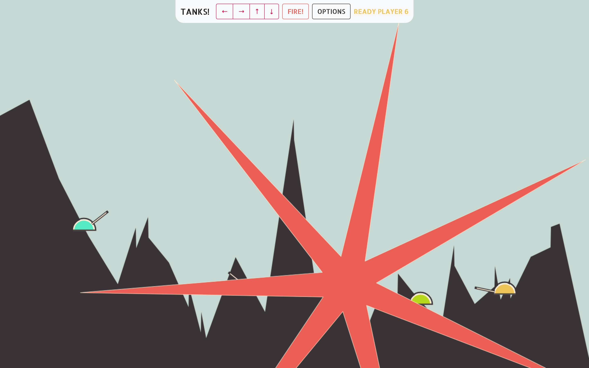
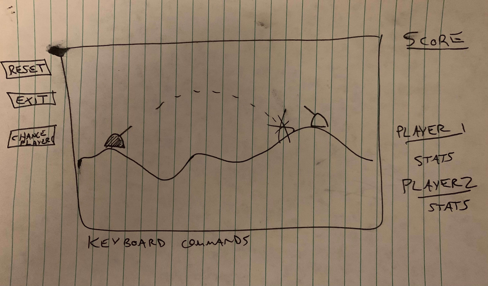

# Tanks! by benhammond.tech

## Concept:

_"What goes up must come down..."_

Players take turns lobbing projectiles; anyone sustaining a hit is destroyed. Last one standing wins!

## Screenshots/Wireframe:

## Tech:

    - HTML
    - CSS / BOOTSTRAP
    - JavaScript / jQuery
    - HTML Canvas

## Approach:

As a kid Tank Wars was an early favorite, and the simple yet compelling game play seemed perfect for my first JS project. Some initial googling of simple games introduced me to HTML Canvas as a well supported, well documented way to draw shapes and lines in the browser. It was important for me to get started quickly with a simple version, while also having the ability to make the game more complex and detailed if time allowed.

## Challenges:

One of the first challenges was simply learning HTML Canvas itself; some ideas that may be standard in animation seemed quirky (e.g. rotating the canvas, drawing a straight line, and rotating back to accomplish an angled line). I got a lot of initial ideas from studying simple JS clock animations.

A second challenge came in implementing the actual physics and math to calculate a projectile's path. While fairly straightforward and well documented in high-school course websites, it took some work translating the physics (gravitational vertical acceleration) and trigonometry (SIN, COSIN) speak into my computer code.

Animation was also problematic; converting my static drawing loops into smooth animations was important for gameplay but eluded me. jCanvas proved to be a helpful library for using jQuery methods to create, manipulate, and importantly animate things drawn with HTML Canvas. I decided to overlay two canvas elements: the first with static background images I'd already made with traditional canvas, and the second with animations using the jCanvas library.

## Known Bugs and Wonkiness Being Fixed:

- Need to refactor and separate graphics from logic... they are too intertwined.
- Terrain generation and drawing needs to be scoped out of game.newGame() to make **Change Terrain** button operational, and to allow **New Game** button to start play on existing terrain.
- Display explosion AFTER shot lands
- Modal flashes the Resume button on ENTER initial screen. ENTER functionality in general.
- Animation timing in general
- Mobile resizing / zooming / clicking. Disable double tap to zoom, etc.
- Refactor my hack fix for the **kill left - skip right** bug.

## Future Ideas:

### Graphics

- Flatten terrain directly below tanks.
- More animations (tank dropping down into place)
- Add chem trails to see last shot. Slow fade out?
- Make craters more jagged, more visually interesting (color?).
- Utilize actual images
- Use some Bézier/Quadratic curves for terrain instead of all straight lines.
- Add snow capped mountains
- Add Trees

### Responsiveness / UI

- Split bootstrap button on new-game to change num players.
- Make mobile responsive and playable with on-screen controls to fire keyboard inputs.
- Add touch functionality for better mobile game-play.
- Save current number of players at game start into local storage so game refresh with the same.

### Logic / Game Play

- **Add computer logic for Robot players.**
- Adjust max shot deltaX deltaY based on screen size (better game play if bullet isn't above screen very much)
- Give tanks more than 1 starting hitpoint; require multiple shots to kill, damage based on shot proximity. Falling could harm tank as well.
- Randomize starting player. Weight towards those in the middle since they are most in danger?
- Spread tanks further apart, rather than evenly spaced.
- Allow shots off screen horizontally to wrap back from other side?
- Allow shots that hit bottom of screen (where ground has been destroyed to bounce)
- Integrate terrain steepness? Increase as gameplay continues in multiple rounds?
- Keep running tally of player wins; allow names for players. Allow custom tank objects.
- Build your own level: click on screen to add terrain nodes. Place your own tanks like in Settlers of Catan.
- Add Day/Night displays, with limited visibility.
- Add wind to buffet shots around horizontally. Trees could indicate wind-direction and velocity.

## Resources

- [Coolor.co - Color Palette Generator](http://www.coolors.co) - Make pretty colors that works together
- [Canvas Clock Demo](http://www.dhtmlgoodies.com/tutorials/canvas-clock/) - Tells time.
- [Keycode.info by Wes Bos](https://keycode.info/) - App to get key codes
- [Goodfon.com Free Sunset Wallpaper](https://www.goodfon.com/)

## External Libraries

- [KeyDrown.JS](https://jeremyckahn.github.io/keydrown/) - Library to speed up user held keys
- [jCanvas](https://projects.calebevans.me/jcanvas/) - Library to use jQuery on HTML Canvas (easier animations)

## Install Instructions

- Visit the link below and play in Chrome browser with javascript enabled. Works best on a desktop computer using the keyboard, but limited mouse/touch integration also allows game play via mobile and other devices.

## App Demo

<!-- - [Play Game](http://www.benhammondmusic.com/tanks/) -->

- [Play Game on GitHub Pages](https://benhammondmusic.github.io/tanks)
- [Mirror Link to Play Game](http://benhammondmusic.com/tanks/)
- [Source Code on GitHub](https://github.com/benhammondmusic/benhammondmusic.github.io/tree/main/tanks)
